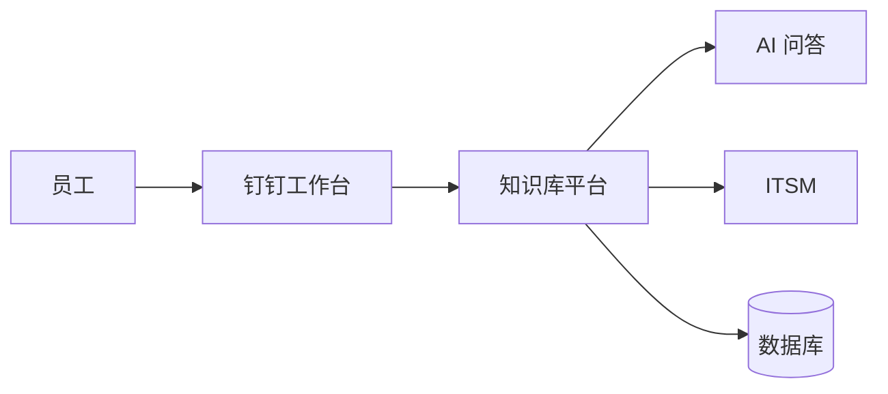

# AI-OpsAI-IT

## 项目简介

AI-OpsAI-IT 是面向企业内部员工的 IT 运维智能知识库平台。平台以钉钉作为统一入口，通过结构化知识管理、智能检索和后续 AI 问答能力，帮助员工快速定位常见故障解决方案，并在知识无法解决问题时衔接现有 IT 服务流程。

## 项目目标

- **故障知识沉淀**：将分散的运维经验转化为可审核、可追溯、可持续维护的知识资产。
- **AI 辅助运维**：建设可信知识底座，为检索增强问答和智能运维能力提供支撑。
- **员工自助服务**：让员工通过搜索、分类和问答快速解决常见 IT 问题。
- **降低 IT 重复工作**：减少重复咨询，使运维人员聚焦复杂故障和服务改进。

## 核心架构



当前 V1.1 聚焦知识库核心能力和钉钉基础集成。AI 检索增强问答与 ITSM 深度联动按照产品路线图逐步建设。

## 工程目录

```text
AI-OpsAI-IT/
├── backend/                 后端工程
├── frontend/                前端工程
├── database/                数据库脚本与迁移
├── scripts/                 工程辅助脚本
├── tests/                   测试工程
└── docs/                    项目文档唯一入口
```

当前工程目录仅建立规范骨架，尚未生成代码。

## 文档目录

| 目录 | 用途 |
| --- | --- |
| [`docs/01-Research`](docs/01-Research/) | 需求调研、访谈问题和参考资料 |
| [`docs/02-PRD`](docs/02-PRD/) | 产品需求文档 |
| [`docs/03-Design`](docs/03-Design/) | 产品、UI 和接口设计 |
| [`docs/04-Architecture`](docs/04-Architecture/) | 系统架构与技术方案 |
| [`docs/05-Database`](docs/05-Database/) | 数据库模型与数据字典 |
| [`docs/06-Process`](docs/06-Process/) | 业务流程与状态流程 |
| [`docs/07-ADR`](docs/07-ADR/) | 架构决策记录 |
| [`docs/08-Meeting`](docs/08-Meeting/) | 会议纪要与决策记录 |
| [`docs/09-KnowledgeBase`](docs/09-KnowledgeBase/) | 故障分类、FAQ、知识文章、AI 问答及 SOP 规范 |
| [`docs/Archive`](docs/Archive/) | 历史版本和归档资料 |

## 项目状态

- 当前阶段：V1.1 需求评审与工程结构规范化。
- 当前范围：知识库核心能力、钉钉入口、免登、权限、搜索、内容生命周期及 IT 服务跳转。
- 后续方向：知识运营增强、AI 检索增强问答、ITSM 深度联动。

## 文档维护约定

- `docs` 是项目文档的唯一入口，新文档应按主题归档到对应编号目录。
- 历史版本和不再维护的源文件进入 `docs/Archive`，不得直接删除。
- 架构重大决策应在 `docs/07-ADR` 中单独记录。
- 项目级重要变更应同步更新 [`CHANGELOG.md`](CHANGELOG.md)。

