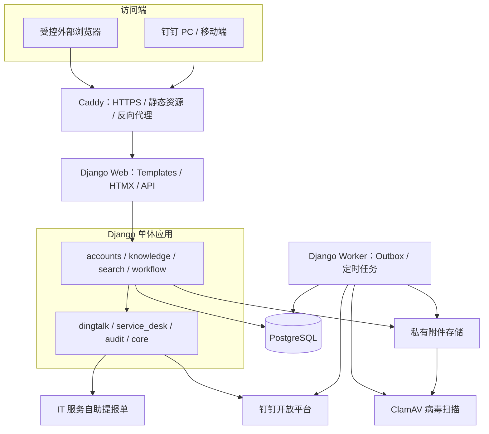
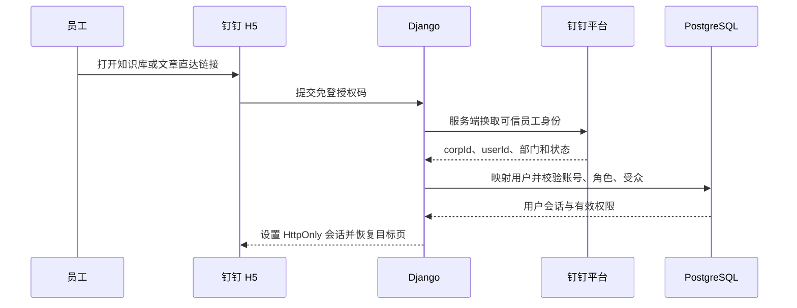

# OpsAI-IT 系统架构与 API 接口清单

> 适用版本：PRD V1.1A（钉钉集成核心试点版） 
> 技术基线：Python 3.13 + Django 5.2 LTS + Django Templates + Bootstrap + HTMX + PostgreSQL + Docker Compose + Caddy

## 1. 结论与边界

本项目采用“模块化 Django 单体”：页面渲染、业务逻辑、权限、搜索、审核、钉钉适配和数据库访问都在一个 Django 代码库中。生产环境只拆成不同进程/容器，不拆成多个微服务。

V1.1A 的最小部署包含 Caddy、Django Web、Django Worker、PostgreSQL 和附件病毒扫描服务。Worker 与 Web 使用同一份 Django 代码；它从数据库 Outbox 表领取通知、同步和复审任务，因此首版不引入 Redis、Celery、Elasticsearch或独立前端工程。

本文的接口范围包括：

- 给 Django 页面、HTMX 和少量前端 JavaScript 使用的 `/api/v1/` 接口；
- 钉钉回调、IT 服务上下文读取等系统间接口；
- 健康检查、受控下载和安全跳转等非 JSON HTTP 端点；
- V1.1A 的 P0 和 P1 能力。V1.1B、AI 问答和完整 ITSM 接口仅列为后续边界，不纳入本期开发。

## 2. 总体架构图

### 2.1 各层职责

| 层 | 组件 | 主要职责 |
| --- | --- | --- |
| 访问层 | 钉钉 H5、PC/移动浏览器 | 获取免登授权码，显示服务端页面，发起 HTMX/JSON 请求 |
| 网关层 | Caddy | HTTPS 证书、HTTP 到 HTTPS 跳转、静态文件、请求转发和基础安全响应头 |
| 表现层 | Django Templates、Bootstrap、HTMX | 服务端渲染页面；局部更新返回 HTML 片段；少量交互返回 JSON |
| 业务层 | `accounts`、`knowledge`、`search`、`workflow` | 用户与 RBAC、文章与版本、受众过滤、检索、审核和状态流转 |
| 适配层 | `dingtalk`、`service_desk` | 隔离钉钉与 IT 服务系统的协议、签名、字段和异常 |
| 横切层 | `audit`、`core` | 审计日志、请求 ID、统一异常、健康检查、公共基类 |
| 数据层 | PostgreSQL、私有附件目录 | 业务数据、PostgreSQL 全文检索、Outbox；附件不由 Caddy 直接公开 |
| 后台任务 | Django Worker | 通知重试、通讯录同步、复审提醒、索引维护；使用数据库锁保证并发安全 |

## 3. 关键调用流程

### 3.1 钉钉免登与权限

### 3.2 发布事务

提交审核、批准发布和紧急下架必须在 `transaction.atomic()` 中完成业务状态、审核记录、当前版本指针、审计记录和 Outbox 事件的写入。钉钉通知由 Worker 在事务提交后异步发送；发送失败不回滚已完成的发布操作，可按幂等键重试。

## 4. API 设计约定

| 项目 | 约定 |
| --- | --- |
| 基础路径 | 业务 JSON/HTMX 接口统一使用 `/api/v1/`；页面路由不加 `/api` |
| 身份认证 | 钉钉授权码只使用一次；服务端创建 Django Session；Cookie 使用 `HttpOnly + Secure + SameSite=Lax` |
| CSRF | 所有由浏览器发起的 `POST/PUT/PATCH/DELETE` 必须通过 Django CSRF 校验 |
| 标识 | 员工侧文章使用不可变 `kb_no`；管理侧关联使用 UUID，不使用可猜测的连续主键 |
| 幂等 | 提交审核、批准、驳回、下架、通知重试、上下文创建接受 `Idempotency-Key` 请求头 |
| 权限 | 每个查询都在服务端做账号状态、系统角色和内容受众校验；拒绝规则优先于允许规则 |
| 错误格式 | JSON 统一返回 `code`、`message`、`request_id`、可选 `field_errors`；不返回堆栈、令牌或钉钉密钥 |
| 分页 | 列表统一使用 `page`、`page_size`，响应返回 `items`、`page`、`page_size`、`total` |
| 时间 | API 使用 ISO 8601 和 UTC；页面按公司时区显示 |
| 附件 | 上传后先隔离，扫描通过才能发布/下载；下载必须走鉴权接口，禁止公开静态直链 |
| 限流 | 免登交换、搜索、反馈、上传、回调和上下文读取分别限流；回调还需验签、防重放 |

权限简称：`员工` 表示已登录且账号有效；`编辑`、`审核`、`知识管理员`、`集成管理员` 均表示对应系统操作权限；`内部服务` 表示仅内网或受控监控调用；`可信 ITSM` 表示经过服务身份认证的目标系统。

## 5. V1.1A API 接口清单

本清单共 91 个 HTTP 端点：72 个纯 P0、18 个纯 P1、1 个同时承载 P0/P1 降级逻辑。端点数不等于 91 个独立代码文件；同一资源的列表、详情和动作应复用同一组 View、Form/Serializer、Service 和 Selector。

| 接口组 | 数量 |
| --- | ---: |
| 系统、认证与当前用户 | 10 |
| 首页、浏览、搜索与反馈 | 12 |
| 文章、版本、受众与标签 | 21 |
| 图片与附件 | 6 |
| 审核、发布与复审 | 7 |
| 表单下拉与选择器 | 9 |
| 钉钉回调、同步与通知 | 8 |
| IT 服务入口 | 5 |
| 管理查询、审计与指标 | 13 |
| **合计** | **91** |

### 5.1 系统、认证与当前用户

| ID | 方法 | 路径 | 用途 | 权限 | 优先级 / PRD |
| --- | --- | --- | --- | --- | --- |
| SYS-001 | GET | `/health/live` | 进程存活检查，不查询外部系统 | 内部服务 | P0 / NFR |
| SYS-002 | GET | `/health/ready` | 检查数据库、附件目录等启动依赖 | 内部服务 | P0 / NFR |
| AUTH-001 | POST | `/api/v1/auth/dingtalk/exchange` | 用一次性授权码换取可信身份并创建 Session | 钉钉内匿名入口 | P0 / DT-003～006 |
| AUTH-002 | POST | `/api/v1/auth/logout` | 删除当前会话并写入退出审计 | 员工 | P0 / DT-009 |
| AUTH-003 | GET | `/api/v1/me` | 返回当前用户、部门、账号状态和首页必要信息 | 员工 | P0 / DT-004～005 |
| AUTH-004 | GET | `/api/v1/me/permissions` | 返回当前用户可执行的操作权限，不返回敏感受众明细 | 员工 | P0 / RBAC-001 |
| AUTH-005 | GET | `/api/v1/dingtalk/jsapi-config` | 按当前页面 URL 生成钉钉 JSAPI 配置和签名 | 员工 | P0 / DT-001～003 |
| AUTH-006 | POST | `/api/v1/auth/sessions/revoke-all` | 撤销本人其他会话，或由管理员撤销指定用户会话 | 员工 / 管理员 | P1 / DT-009 |
| ME-001 | GET | `/api/v1/me/notification-preferences` | 读取本人可退订通知类型和汇总设置 | 员工 | P1 / NTF-006 |
| ME-002 | PUT | `/api/v1/me/notification-preferences` | 更新非强制通知偏好；审核结果等强制通知不可关闭 | 员工 | P1 / NTF-006 |

### 5.2 首页、浏览、搜索与反馈

| ID | 方法 | 路径 | 用途 | 权限 | 优先级 / PRD |
| --- | --- | --- | --- | --- | --- |
| HOME-001 | GET | `/api/v1/home` | 返回当前用户可见的分类、热门知识、公告和服务入口 | 员工 | P0 / KB-001～005 |
| HOME-002 | GET | `/api/v1/categories` | 返回当前用户可见的启用分类树 | 员工 | P0 / KB-002 |
| HOME-003 | GET | `/api/v1/categories/{category_id}/articles` | 分页返回分类内的可见已发布知识 | 员工 | P0 / KB-002 |
| KB-001 | GET | `/api/v1/articles/{kb_no}` | 返回当前可见发布版本；无权限时不得泄露标题或存在性 | 员工 | P0 / KB-007～009、RBAC-003 |
| KB-002 | POST | `/api/v1/articles/{kb_no}/views` | 记录去重后的有效文章访问事件 | 员工 | P0 / 指标 |
| KB-003 | POST | `/api/v1/articles/{kb_no}/feedback` | 提交已解决、未解决、错误、过期或看不懂反馈 | 员工 | P0 / KB-010～011 |
| KB-004 | GET | `/api/v1/media/{media_id}/content` | 鉴权后以内联或下载方式输出扫描通过的附件 | 员工且命中文章受众 | P0 / KB-025、RBAC-004 |
| KB-005 | POST | `/api/v1/submissions` | 员工提交问题、解决思路和受控附件到待整理队列 | 员工 | P1 / KB-026 |
| KB-006 | GET | `/api/v1/submissions/mine` | 查看本人投稿及处理状态 | 员工 | P1 / KB-026 |
| SR-001 | GET | `/api/v1/search` | 全文检索、筛选、排序、高亮和零结果处理 | 员工 | P0 / SR-001～005、008 |
| SR-002 | POST | `/api/v1/search/{search_session_id}/clicks` | 记录搜索结果点击及排名位置 | 员工 | P0 / 指标 |
| SR-003 | GET | `/api/v1/search/suggestions` | 返回经过受众过滤的标题、标签和常见问题联想 | 员工 | P1 / SR-006 |

`SR-001` 的主要查询参数为 `q`、`category_id`、`article_type`、`applicable_system`、`updated_after`、`sort`、`page` 和 `page_size`。返回结果数、标题、摘要、高亮片段和附件名之前都必须完成权限过滤。

### 5.3 编辑端：文章、版本、受众与标签

| ID | 方法 | 路径 | 用途 | 权限 | 优先级 / PRD |
| --- | --- | --- | --- | --- | --- |
| ART-001 | GET | `/api/v1/manage/articles` | 按空间、状态、负责人、复审日期查询可管理文章 | 编辑 / 审核 / 知识管理员 | P0 / ADM-003 |
| ART-002 | POST | `/api/v1/manage/articles` | 创建文章主记录和首个草稿版本 | 编辑 | P0 / KB-014～015 |
| ART-003 | GET | `/api/v1/manage/articles/{article_id}` | 读取文章主数据、指针、状态和管理权限 | 有该文章管理权 | P0 / KB-014～020 |
| ART-004 | PATCH | `/api/v1/manage/articles/{article_id}` | 修改负责人、分类、类型、复审时间等主数据 | 编辑 / 知识管理员 | P0 / KB-014、020 |
| ART-005 | GET | `/api/v1/manage/articles/{article_id}/versions` | 查看完整版本链和审核摘要 | 有该文章管理权 | P0 / KB-019 |
| ART-006 | POST | `/api/v1/manage/articles/{article_id}/versions` | 基于当前发布版或指定历史版创建新草稿 | 编辑 | P0 / KB-015、019 |
| ART-007 | GET | `/api/v1/manage/articles/{article_id}/audiences` | 查看文章的允许/拒绝受众规则 | 有该文章授权管理权 | P0 / RBAC-002 |
| ART-008 | PUT | `/api/v1/manage/articles/{article_id}/audiences` | 原子替换部门、用户组、用户、全员或仅 IT 受众 | 编辑 / 知识管理员 | P0 / RBAC-002、005 |
| ART-009 | GET | `/api/v1/manage/articles/{article_id}/tags` | 查看文章标签 | 有该文章管理权 | P0 / DATA-002 |
| ART-010 | PUT | `/api/v1/manage/articles/{article_id}/tags` | 原子替换文章标签关系 | 编辑 | P0 / DATA-002 |
| ART-011 | POST | `/api/v1/manage/articles/{article_id}/offline` | 紧急下架并填写原因，保留当前版本用于审计 | 审核 / 知识管理员 | P0 / KB-018 |
| ART-012 | POST | `/api/v1/manage/articles/{article_id}/archive` | 将已下架文章归档，不硬删除 | 知识管理员 | P0 / 状态模型 |
| ART-013 | GET | `/api/v1/manage/articles/review-due` | 查询即将复审和已逾期文章 | 编辑 / 审核 / 知识管理员 | P0 / KB-020、ADM-003 |
| ART-014 | POST | `/api/v1/manage/articles/batch-update` | 批量调整负责人、分类、标签、复审日和受众 | 知识管理员 | P1 / KB-022 |
| VER-001 | GET | `/api/v1/manage/article-versions/{version_id}` | 读取草稿、待审或历史版本详情 | 有该文章管理权 | P0 / KB-015、019 |
| VER-002 | PATCH | `/api/v1/manage/article-versions/{version_id}` | 手动保存可编辑版本及变更说明 | 作者 / 授权编辑 | P0 / KB-015 |
| VER-003 | PUT | `/api/v1/manage/article-versions/{version_id}/autosave` | 带乐观锁版本号的自动保存 | 作者 / 授权编辑 | P0 / KB-015 |
| VER-004 | POST | `/api/v1/manage/article-versions/{version_id}/preview` | 校验字段并返回安全渲染的预览 HTML | 作者 / 授权编辑 | P0 / KB-015 |
| VER-005 | POST | `/api/v1/manage/article-versions/{version_id}/submit` | 冻结版本、创建待审事件并通知审核员 | 作者 / 授权编辑 | P0 / KB-016、NTF-001 |
| VER-006 | POST | `/api/v1/manage/article-versions/{version_id}/discard` | 软删除未提交草稿；已审核版本不可删除 | 作者 / 授权编辑 | P0 / 状态模型 |
| VER-007 | GET | `/api/v1/manage/article-versions/{version_id}/diff` | 与 `against` 指定版本进行文本差异比较 | 编辑 / 审核 | P1 / KB-021 |

### 5.4 编辑端：图片与附件

| ID | 方法 | 路径 | 用途 | 权限 | 优先级 / PRD |
| --- | --- | --- | --- | --- | --- |
| MEDIA-001 | GET | `/api/v1/manage/article-versions/{version_id}/media` | 返回版本下的附件及扫描状态 | 有该版本管理权 | P0 / KB-025 |
| MEDIA-002 | POST | `/api/v1/manage/article-versions/{version_id}/media` | 分片或普通上传文件并进入隔离区 | 作者 / 授权编辑 | P0 / KB-008、025 |
| MEDIA-003 | GET | `/api/v1/manage/media/{media_id}` | 查看附件元数据、归属版本和保留期 | 有该版本管理权 | P0 / KB-025 |
| MEDIA-004 | DELETE | `/api/v1/manage/media/{media_id}` | 删除尚未发布草稿中的附件并记录审计 | 作者 / 授权编辑 | P0 / KB-025 |
| MEDIA-005 | GET | `/api/v1/manage/media/{media_id}/scan-status` | 查询病毒扫描结果与失败原因 | 有该版本管理权 | P0 / KB-025 |
| MEDIA-006 | POST | `/api/v1/manage/media/{media_id}/rescan` | 对扫描失败或异常附件重新入队 | 知识管理员 | P0 / KB-025 |

### 5.5 审核、发布与复审

| ID | 方法 | 路径 | 用途 | 权限 | 优先级 / PRD |
| --- | --- | --- | --- | --- | --- |
| REV-001 | GET | `/api/v1/reviews/inbox` | 返回当前审核员可处理的待审版本 | 审核 | P0 / KB-017、NTF-001 |
| REV-002 | GET | `/api/v1/reviews/article-versions/{version_id}` | 返回冻结的待审内容、受众、附件和风险提示 | 审核 | P0 / KB-017 |
| REV-003 | GET | `/api/v1/reviews/article-versions/{version_id}/records` | 返回该版本审核记录 | 编辑 / 审核 / 知识管理员 | P0 / KB-019 |
| REV-004 | POST | `/api/v1/reviews/article-versions/{version_id}/approve` | 非作者审核通过并原子发布、替代旧版本 | 审核 | P0 / KB-017～019、NTF-002 |
| REV-005 | POST | `/api/v1/reviews/article-versions/{version_id}/reject` | 填写意见并驳回，通知作者 | 审核 | P0 / KB-017、NTF-002 |
| REV-006 | GET | `/api/v1/reviews/due` | 查询本人负责或可审核的复审任务 | 编辑 / 审核 / 知识管理员 | P0 / KB-020 |
| REV-007 | POST | `/api/v1/reviews/articles/{article_id}/periodic` | 记录继续有效、需要修订或立即下架的复审结论 | 审核 / 知识管理员 | P0 / KB-020 |

审核服务必须拒绝“作者审核自己”的请求；特批流程若启用，需校验临时授权、原因和有效期，并额外写入审计记录。

### 5.6 表单下拉与选择器

这些是只读接口，用于文章编辑和后台表单，避免把整张用户、部门或标签表嵌入页面。

| ID | 方法 | 路径 | 用途 | 权限 | 优先级 / PRD |
| --- | --- | --- | --- | --- | --- |
| LOOK-001 | GET | `/api/v1/lookups/knowledge-spaces` | 返回当前用户可管理的知识空间 | 编辑 / 审核 / 知识管理员 | P0 / ADM-001 |
| LOOK-002 | GET | `/api/v1/lookups/categories` | 按 `space_id` 返回启用分类 | 编辑 / 知识管理员 | P0 / ADM-001 |
| LOOK-003 | GET | `/api/v1/lookups/article-types` | 返回文章类型枚举和表单规则 | 编辑 / 知识管理员 | P0 / ADM-001 |
| LOOK-004 | GET | `/api/v1/lookups/tags` | 按关键词搜索启用标签 | 编辑 / 知识管理员 | P0 / ADM-001 |
| LOOK-005 | GET | `/api/v1/lookups/article-templates` | 按文章类型返回可用模板 | 编辑 | P0 / KB-014 |
| LOOK-006 | GET | `/api/v1/lookups/departments` | 搜索启用部门，用于内容受众选择 | 编辑 / 知识管理员 | P0 / RBAC-002 |
| LOOK-007 | GET | `/api/v1/lookups/user-groups` | 搜索内容用户组，不返回系统角色 | 编辑 / 知识管理员 | P0 / RBAC-002 |
| LOOK-008 | GET | `/api/v1/lookups/users` | 按姓名/工号搜索有效用户，字段最小化 | 编辑 / 审核 / 知识管理员 | P0 / RBAC-002 |
| LOOK-009 | GET | `/api/v1/lookups/reviewers` | 返回当前文章空间内符合条件的审核员 | 编辑 / 知识管理员 | P0 / KB-016 |

### 5.7 钉钉回调、通讯录同步与通知

| ID | 方法 | 路径 | 用途 | 权限 | 优先级 / PRD |
| --- | --- | --- | --- | --- | --- |
| DT-001 | POST | `/api/v1/integrations/dingtalk/callback` | 接收并验签钉钉组织/应用事件，按事件 ID 去重 | 钉钉回调验签 | P1 / DT-008 |
| DT-002 | POST | `/api/v1/admin/dingtalk/sync/users/{user_id}` | 按钉钉用户标识同步单个用户及部门 | 集成管理员 | P1 / DT-008 |
| DT-003 | POST | `/api/v1/admin/dingtalk/sync/full` | 创建全量通讯录同步任务，不在请求内长时间执行 | 集成管理员 | P1 / DT-008 |
| DT-004 | GET | `/api/v1/admin/dingtalk/sync-jobs` | 查询同步任务列表、状态和统计 | 集成管理员 | P1 / ADM-004 |
| DT-005 | GET | `/api/v1/admin/dingtalk/sync-jobs/{job_id}` | 查看单次同步的错误和处理结果 | 集成管理员 | P1 / ADM-004 |
| DT-006 | GET | `/api/v1/admin/notifications` | 查询工作通知状态、业务幂等键和重试次数 | 集成管理员 / 知识管理员 | P0 / NTF-001～005 |
| DT-007 | POST | `/api/v1/admin/notifications/{notification_id}/retry` | 重试一条可重试的失败通知 | 集成管理员 | P0 / NTF-005 |
| DT-008 | POST | `/api/v1/admin/notifications/test` | 向当前管理员发送测试通知 | 集成管理员 | P1 / NTF-006 |

Django 服务端还要封装以下“出站能力”，但它们不是本系统对外暴露的 URL：获取应用访问凭证、用授权码获取用户身份、查询部门/用户、发送工作通知、校验回调签名。实际钉钉路径和参数以开发时的官方文档与已申请权限为准，统一封装在 `dingtalk.client`，业务 App 不直接调用第三方 SDK。

### 5.8 IT 服务入口与安全上下文

| ID | 方法 | 路径 | 用途 | 权限 | 优先级 / PRD |
| --- | --- | --- | --- | --- | --- |
| SVC-001 | GET | `/api/v1/service-entry` | 返回唯一 IT 服务目标、备用入口和最小问题描述模板 | 员工 | P0 / SVC-001～002、004 |
| SVC-002 | POST | `/api/v1/service-contexts` | 创建短期、一次性 `context_token`，不把敏感搜索词放入 URL | 员工 | P1 / SVC-003 |
| SVC-003 | GET | `/api/v1/service-contexts/{token}` | 由目标系统一次性读取来源、知识编号、分类和终端 | 可信 ITSM | P1 / SVC-003 |
| SVC-004 | POST | `/api/v1/service-jumps` | 记录点击、目标打开成功/失败和降级结果 | 员工 | P0 / SVC-004～005 |
| SVC-005 | GET | `/service/jump/{token}` | 校验上下文后 302 跳转；失败时显示备用入口 | 员工 | P0/P1 / SVC-001～005 |

`SVC-003` 只在现有 IT 服务系统能够做服务端回调时启用；如果目标不支持，则 `SVC-001` 返回受控直达地址，`SVC-004` 仅记录“是否成功打开”，不虚构表单已提交状态。

### 5.9 管理查询、审计和基础指标

| ID | 方法 | 路径 | 用途 | 权限 | 优先级 / PRD |
| --- | --- | --- | --- | --- | --- |
| ADM-001 | GET | `/api/v1/admin/feedback` | 查询未解决、错误、过期等反馈队列 | 编辑 / 知识管理员 | P0 / KB-010、ADM-003 |
| ADM-002 | PATCH | `/api/v1/admin/feedback/{feedback_id}` | 更新反馈处理状态、负责人和备注 | 编辑 / 知识管理员 | P0 / 反馈规则 |
| ADM-003 | GET | `/api/v1/admin/submissions` | 查询员工投稿待整理队列 | 编辑 / 知识管理员 | P1 / KB-026 |
| ADM-004 | PATCH | `/api/v1/admin/submissions/{submission_id}` | 接受、驳回、关联文章并填写处理说明 | 编辑 / 知识管理员 | P1 / KB-026 |
| LOG-001 | GET | `/api/v1/admin/audit-logs` | 按操作者、对象、动作和时间查询审计日志 | 知识管理员 / 授权审计员 | P0 / RBAC-005、DATA-004 |
| LOG-002 | GET | `/api/v1/admin/audit-logs/{log_id}` | 查看变更前后快照和请求链路 | 知识管理员 / 授权审计员 | P0 / DATA-004 |
| LOG-003 | GET | `/api/v1/admin/integration-logs` | 查询免登、同步、通知和服务跳转集成日志 | 集成管理员 | P0 / ADM-004 |
| LOG-004 | GET | `/api/v1/admin/integration-logs/{log_id}` | 查看脱敏后的错误码、请求 ID 和重试信息 | 集成管理员 | P0 / ADM-004 |
| MET-001 | GET | `/api/v1/admin/metrics/overview` | 返回进入、搜索、反馈、复审和服务打开基础指标 | 知识管理员 | P0 / 成功指标、ADM-005 |
| MET-002 | GET | `/api/v1/admin/metrics/search` | 返回查询量、点击率、零结果率和高频无结果词 | 知识管理员 | P0 / SR-008 |
| MET-003 | GET | `/api/v1/admin/metrics/content` | 返回访问、反馈解决率和复审按期率 | 知识管理员 | P0 / 成功指标 |
| MET-004 | GET | `/api/v1/admin/metrics/service-jumps` | 返回服务入口点击和打开成功率 | 知识管理员 / 集成管理员 | P0 / SVC-005 |
| MET-005 | GET | `/api/v1/admin/metrics/auth` | 返回应用打开与后端身份交换成功率 | 集成管理员 | P0 / 成功指标 |

## 6. 首版使用 Django Admin、无需另写 REST API 的能力

为降低个人开发者的工作量，下列低频配置直接使用 Django Admin。它们仍需开发 ModelAdmin、表单校验、权限控制和审计，但不需要再做一套自定义 CRUD API 和管理页面。

| 管理对象 | 首版操作 |
| --- | --- |
| 知识空间、分类、标签、文章模板 | 新建、编辑、启用/停用、排序；禁止删除已被业务数据引用的对象 |
| 首页模块与系统配置 | 热门规则、公告、复审提前天数、附件类型/大小、IT 联系方式和服务目标 |
| 用户、部门和钉钉映射 | 只读查看同步结果；允许禁用平台账号；组织字段以钉钉同步为准 |
| 系统角色、权限点、用户角色 | 授权、撤销、生效/失效时间；所有变更写审计日志 |
| 内容用户组及成员 | 维护受众用户组；不得与系统操作角色共用同一张表 |
| 同义词 | PRD 已放入 V1.1B，因此 V1.1A 不开发管理接口 |
| 钉钉配置 | 普通配置可维护；AppSecret 仅保存环境变量或密文引用，后台不回显明文 |

## 7. 服务端页面路由

这些路由由 Django Templates 渲染，不应为了“看起来像前后端分离”再复制一套页面 API。

| 路径 | 页面 |
| --- | --- |
| `/` | 首页 |
| `/search/` | 搜索结果页 |
| `/categories/{category_id}/` | 分类页 |
| `/kb/{kb_no}/` | 知识详情或无权限/下架提示页 |
| `/submissions/new/` | 员工投稿页（P1） |
| `/manage/articles/` | 内容管理列表 |
| `/manage/articles/new/` | 创建文章 |
| `/manage/articles/{article_id}/edit/` | 编辑草稿 |
| `/reviews/` | 审核待办 |
| `/reviews/{version_id}/` | 审核详情 |
| `/admin/` | Django Admin 配置后台 |
| `/auth/error/` | 免登失败、重试和 IT 联系方式 |

## 8. 本期不开发但需保留边界的接口

| 后续阶段 | 暂不开发的接口领域 |
| --- | --- |
| V1.1B | 收藏、最近浏览、评论/截图反馈、视频、相关推荐、同义词后台、完整运营看板、数据导出、版本差异和批量维护（其中差异/批量若资源允许可按本文 P1 提前实现） |
| V2.0 | `/api/v2/ai/query`、会话、引用来源、AI 反馈、RAG 索引管理和模型安全控制 |
| V3.0 | 工单创建、工单状态回写、知识推荐、工单转知识、资产与账号权限联动 |

不要在 V1.1A 预先创建空接口；只需保持 `service_desk`、`search`、`knowledge` 的服务边界和 UUID 标识稳定。

## 9. 推荐开发顺序

1. 先完成 `SYS-*`、`AUTH-*`、用户/部门模型和会话安全，打通钉钉免登。
2. 完成知识空间、分类、文章、版本、受众、审核和附件模型及 Django Admin。
3. 完成 `HOME-*`、`KB-*`、`SR-*`，先让员工能安全搜索和阅读。
4. 完成 `ART-*`、`VER-*`、`REV-*`，打通草稿—审核—发布—下架的事务闭环。
5. 完成 `MEDIA-*` 和 ClamAV 扫描，未通过扫描的附件不得进入发布版本。
6. 完成 `DT-*`、Outbox Worker、通知重试和复审提醒。
7. 最后完成 `SVC-*`、`LOG-*`、`MET-*` 以及 P1 投稿、同步和增强功能。

每完成一组接口，都至少覆盖：正常路径、未登录、账号禁用、无操作权限、未命中文章受众、重复请求、并发状态冲突和外部服务失败。
